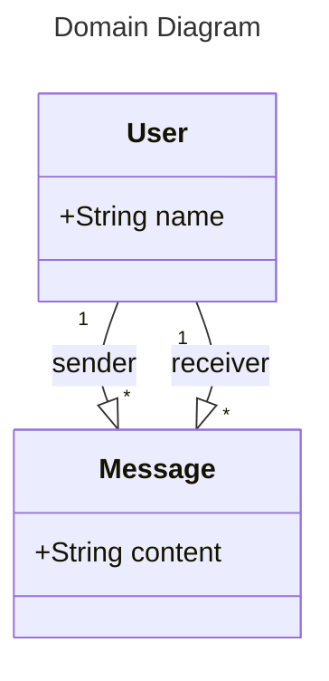

# Simple messaging app

Run with:
```bash
bundle install
bundle exec ruby src/app.rb # Production
bundle exec rerun 'src/app.rb' # Development (auto-reload)
```

Test with:
```bash
# Ping
curl http://127.0.0.1:4567/

# Create users
curl -s --request POST http://127.0.0.1:4567/users --data '{"name": "someone 1"}' | jq
curl -s --request POST http://127.0.0.1:4567/users --data '{"name": "someone 2"}' | jq

# Get user
curl -s --request GET http://127.0.0.1:4567/users/1 | jq

# Send message
curl -s --request POST http://127.0.0.1:4567/users/1/messages --data '{"to": "2", "content": "Hi 2"}' | jq

# Get messages
curl -s --request GET http://127.0.0.1:4567/users/1/messages | jq
```

# Application description

This app is written in Ruby using the [Sinatra Web Framework](https://sinatrarb.com/).

## Project structure:

```bash
├── data
│   └── data.db
├── Gemfile
├── Gemfile.lock
├── README.md
└── src
    ├── app.rb
    └── models.rb
```

- `data`: folder contains a sample sqlite3 database
- `Gemfile` and `Gemfile.lock` describe the required gems of the application:
    - `sinatra`: Web framework used in the app
    - `sqlite3`: Provides a library to interface with sqlite3 databases
    - `activerecord`: ORM used by Rails
- `src`
    - `app.rb`: Endpoints of the application
    - `models.rb`: Database schema definitions

<details>
<summary><h2>Domain diagram</h2></summary>



</details>
